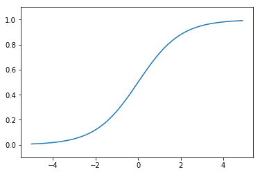

## Basic functions in DL with np

numpy를 이용한 DL 관련 함수들을 정리해본다.

numpy는 python에서 computer sicence 관련 계산을 위한 필수적인 package이며 아래와 같은 기능을 제공한다

1. powerful N-dimensional array object
2. Sophiscated (broadcasting) functions
3. tools for intergrating C/C++ and Fortran code
4. useful linear algebra, Fourier transform, and random number capabilities

사실 numpy가 DL에서 많이 쓰이는 이유는 vector 연산때문이라고 할 수 있다. 수 많은 for loop을 사용하지 않고 단 몇 줄로도 for loop을 대체하고 vector 기반으로 계산이 가능하다.

#### step function

``` python
import numpy as np
import matplotlib.pyplot as plt

def step_function(x):
    if x > 0:
        return 1
    else :
        return 0
 
def np_step_function(x):
    y = x > 0
    return y.astype(np.int)
#api usage
x = np.arange(-3, 3, 0.1)
y = np_step_function(x)
plt.plot(x, y)
plt.show()
```

- step_function의 경우, numpy array를 입력 받을 수 없다. 
- np_step_function은 y = x > 0에서 boolean 형식의 numpy array가 반환되는 것을 응용헤서 구현한 것이다.


#### sigmoid function

$$
\begin{aligned} sigmoid(x) = \frac{e^{-x}}{1+ e^{x}}=\frac{1}{1 + e^{-x}}\end{aligned}
$$

```python
def sigmoid(x):
    return 1 / (1 + np.exp(-x))
#api usage
x = np.arange(-5, 5, 0.1)
plt.plot(x, sigmoid(x))
plt.ylim(-0.1, 1.1)
plt.show()
```



#### ReLu function

```python
import numpy as np
def Relu(x):
    return np.maximum(0, x)

a = np.arange(-3, 3, 0.1)
plt.plot(a, Relu(a))
plt.ylim(-0.5, 4)
plt.show()
```


#### Softmax function

- softmax 함수는 출력 층에서 3-class 이상의 classification을 목적으로 쓰이는 활성화 함수다.

$$
y_k = \frac{exp(a_k)}{\sum^n_{i=1}(exp(a_i))}
$$

```python
import numpy as np

def softmax(a):# a is numpy array
    exp_a = np.exp(a)
    sum_exp_a = np.sum(exp_a)
    y = exp_a / sum_exp_a
    return y

#api useage
a = np.array([1, 2, 3])
print(a)
print(softmax(a))
print(sum(softmax(a)))
```

