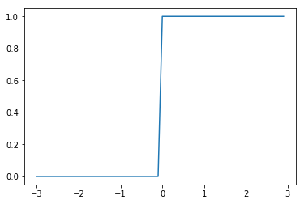

# Basic functions in DL with numpy

## Contents
[numpy package](#numpy-packages)

[numpy array](#numpy-array)

[numpy operation](#numpy-array-operation)


-----

## numpy
### numpy package
numpy는 python에서 computer sicence 관련 계산을 위한 필수적인 package이며 DL분야(?)에서도 필수(!)적인 역할을 담당한다. numpy는 아래와 같은 기능을 제공한다

> 1. powerful N-dimensional array object
> 2. Sophiscated (broadcasting) functions
> 3. tools for intergrating C/C++ and Fortran code
> 4. useful linear algebra, Fourier transform, and random number capabilities

numpy가 DL에서 많이 쓰이는 이유는 vector 연산때문이라고 할 수 있는데 실제로 for loop 보다 작은 code line, operation time으로 동작 가능하다.

------
### numpy array
numpy에서 array는 동일한 자료형의 값들의 모임을 의미하고, 배열의 차원을 rank, 각 차원의 크기를 tuple로 표시하는 것을 shape라고 한다.
> 예를 들어 2 * 3의 2차원 array에서 rank는 2, shape는 (2, 3)이다.

### numpy array operation
#### basic operations
``` python
import numpy as np

x = np.array([[1, 2], [3, 4]], dtype = np.float64)
y = np.array([[5, 6], [7, 8]], dtype = np.float64)

print("x+y")
print(np.add(x, y))
#[[6, 8]
# [10, 12]]

print("x-y")
print(np.substract(x, y))
#[[-4, -4]
# [-4, -4]]

print('x*y")
print(np.multiply(x, y))
#[[5, 12]
# [21, 32]]

print('x dot y")
print(np.dot(x, y))
#[[19, 22]
# [43, 50]]

print(np.divide(x, y))
#[[0.2,, 0.33333]
# [0.42857, 0.5]]

print(np.sqrt(x))
```
Matlab과는 달리, numpy에서의 곱(multiply)는 요소별 곱이다. Numpy에선 행렬 곱(dot)을 지원하며, 덕분에 vector의 내적, 스칼라등의 연산에 용이하다.

#### Broadcasting
Broadcasting은 shape가 다른 array간에도 산술연산이 가능하케하는 feature이다. 

다음은 numpy로 구현한 DL 관련 basic function들이다.

TBD

#### step function

``` python
import numpy as np
import matplotlib.pyplot as plt

def step_function(x):
    if x > 0:
        return 1
    else :
        return 0
 
def np_step_function(x):
    y = x > 0
    return y.astype(np.int)
#api usage
x = np.arange(-3, 3, 0.1)
y = np_step_function(x)
plt.plot(x, y)
plt.show()
```

- step_function의 경우, numpy array를 입력 받을 수 없다. 
- np_step_function은 y = x > 0에서 boolean 형식의 numpy array가 반환되는 것을 응용헤서 구현한 것이다.




#### sigmoid function

$$
\begin{aligned} sigmoid(x) = \frac{e^{-x}}{1+ e^{x}}=\frac{1}{1 + e^{-x}}\end{aligned}
$$

```python
def sigmoid(x):
    return 1 / (1 + np.exp(-x))
#api usage
x = np.arange(-5, 5, 0.1)
plt.plot(x, sigmoid(x))
plt.ylim(-0.1, 1.1)
plt.show()
```


#### ReLu function

```python
import numpy as np
def Relu(x):
    return np.maximum(0, x)

a = np.arange(-3, 3, 0.1)
plt.plot(a, Relu(a))
plt.ylim(-0.5, 4)
plt.show()
```


#### Softmax function

- softmax 함수는 출력 층에서 3-class 이상의 classification을 목적으로 쓰이는 활성화 함수다.

$$
y_k = \frac{exp(a_k)}{\sum^n_{i=1}(exp(a_i))}
$$

```python
import numpy as np

def softmax(a):# a is numpy array
    exp_a = np.exp(a)
    sum_exp_a = np.sum(exp_a)
    y = exp_a / sum_exp_a
    return y

#api useage
a = np.array([1, 2, 3])
print(a)
print(softmax(a))
print(sum(softmax(a)))
```

